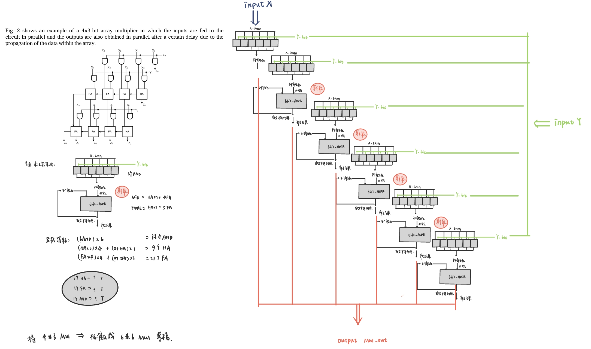
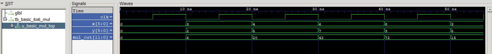

# SME_306_PROJ
【A code space for sme306 project 6x6_mul architecture design and test.】 

Be careful that this is not the solution for the proj, it's just a test space for myself !!!

## source 
RTL for mul_architecture design 

【Basic 6x6 mul design process】:）from 4x3 to uniform 6x6 architecture，it's a very casual handwrite✍,don't care QAQ!

## testbench  
TB for the RTL design

【Basic 6x6 mul tb waveform】:）All sucessed, all in dec data form.

## constrain
CS for the RTL design (in order to test freqency or delay)

## mul_delay_test
A VVD2024.1 PROJ for testing.

### WISH YOU A GOOD DAY~

